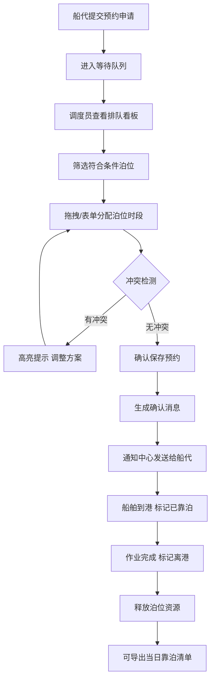

## 1. 产品概述
水路运输泊位预约 Web 应用，为港口调度员和船代提供在线靠泊安排与调度管理平台。系统通过可视化日历、拖拽调度、实时看板等功能，提升港口泊位利用率与调度效率，减少人工协调成本。

- 目标用户：港口调度员、船舶代理公司
- 核心价值：可视化泊位资源管理、智能冲突检测、高效协同调度

## 2. 核心功能

### 2.1 用户角色
| 角色 | 注册方式 | 核心权限 |
|------|---------|---------|
| 港口调度员 | 系统分配账号 | 全功能管理：调度靠泊、标记状态、发送通知、导出清单 |
| 船舶代理 | 系统分配账号 | 提交预约申请、查看排队状态、接收确认通知 |

### 2.2 功能模块
1. **船舶计划页**：今日/本周船舶靠泊计划列表，支持筛选、搜索、状态标记
2. **泊位日历**：按日期/泊位维度的可视化日历，拖拽调整靠泊顺序，冲突高亮提示
3. **预约表单**：登记船名、吨位、吃水、货类、预计到港/离港时间、作业需求
4. **排队看板**：等待船舶队列、空闲泊位、超时预警，实时调度状态展示
5. **通知中心**：船代确认消息、改期通知、状态变更提醒、站内消息

### 2.3 页面详情
| 页面名称 | 模块名称 | 功能描述 |
|---------|---------|---------|
| 船舶计划页 | 计划列表 | 展示船舶信息、泊位、时段、状态标签，支持按船名/货类/状态筛选 |
| 船舶计划页 | 操作栏 | 新增预约、导出今日清单、搜索框、日期切换 |
| 船舶计划页 | 状态标记 | 待确认→已确认→已靠泊→离港状态流转，记录改期原因弹窗 |
| 泊位日历 | 周/日视图切换 | 横向7天/单日纵向时间轴视图，泊位为行，时间为列 |
| 泊位日历 | 时段卡片 | 展示船名+吨位+货类，颜色区分状态，支持拖拽移动 |
| 泊位日历 | 筛选器 | 按泊位水深、作业能力（集装箱/散货/液体）过滤可用泊位 |
| 泊位日历 | 冲突提示 | 时间重叠红色边框+感叹号图标，hover显示冲突详情 |
| 预约表单 | 基础信息 | 船名、呼号、国籍、吨位（DWT）、吃水深度、船长 |
| 预约表单 | 货物信息 | 货类下拉（集装箱/散货/油品/液化气体/件杂货）、货量、特殊作业需求 |
| 预约表单 | 时间信息 | 预计到港ETA、预计靠泊、预计离港ETD，时间校验 |
| 预约表单 | 泊位选择 | 自动推荐符合条件泊位，手动选择并显示可用性 |
| 排队看板 | 等待队列 | 按优先级/ETA排序的等待船舶卡片，显示预计等待时长 |
| 排队看板 | 泊位状态 | 空闲/占用/维护泊位卡片，水深、作业能力、当前船舶 |
| 排队看板 | 超时提醒 | 预计到港超时、作业超时红色闪烁警示条 |
| 排队看板 | 统计卡片 | 今日靠泊数、等待数、空闲泊位数、异常数 |
| 通知中心 | 消息列表 | 分类标签（全部/确认/改期/提醒），未读红点标记 |
| 通知中心 | 发送消息 | 给船代发送靠泊确认、改期通知、自定义消息 |
| 通知中心 | 消息详情 | 展开查看完整消息、关联船舶信息、一键回复 |

## 3. 核心流程

调度员调度主流程：
1. 调度员登录系统，查看排队看板中等待船舶和空闲泊位
2. 在泊位日历中筛选符合条件的泊位（按水深、作业能力）
3. 从排队看板拖拽船舶卡片到日历可用时段，或点击新增预约填写表单
4. 系统自动检测时间冲突并高亮提示
5. 确认无冲突后保存预约，系统自动生成确认消息
6. 在通知中心向船代发送靠泊确认通知
7. 船舶到港后，调度员在计划页标记「已靠泊」状态
8. 作业完成离港后，标记「离港」并释放泊位资源
9. 每日结束可导出当天靠泊清单

## 4. 用户界面设计

### 4.1 设计风格
- **主色调**：深海蓝 `#0c4a6e` 作为主色，搭配海青蓝 `#0ea5e9` 强调色，模拟港口海洋氛围
- **辅助色**：琥珀橙 `#f59e0b` 表示待确认/等待，翡翠绿 `#10b981` 表示已确认/空闲，玫红 `#ef4444` 表示冲突/超时
- **背景层次**：深灰蓝底色 `#0f172a` + 细微网格纹理，营造专业工业感
- **按钮风格**：圆角 6px，轻微投影，hover 有背景色过渡动画
- **字体**：标题使用「思源黑体 Bold / Noto Sans SC Bold」，正文「思源黑体 Regular」，数字使用等宽字体增强数据感
- **布局**：顶部全局导航栏 + 左侧页面标签 + 主内容区卡片式布局
- **图标风格**：线性简洁图标（船锚、日历、集装箱、警示铃等），搭配 SVG 微动画

### 4.2 页面设计概述
| 页面名称 | 模块名称 | UI 元素 |
|---------|---------|---------|
| 船舶计划页 | 顶部工具栏 | 深蓝背景栏，搜索框带船锚图标，导出按钮带下拉箭头，状态筛选胶囊 |
| 船舶计划页 | 计划表格 | 斑马纹行，状态标签带发光圆点，操作按钮行内弹出菜单 |
| 泊位日历 | 时间轴 | 左侧泊位列（水深/能力标签），顶部日期行带周几，网格交叉点为卡片容器 |
| 泊位日历 | 预约卡片 | 渐变色块（按状态），圆角4px，阴影微浮起，拖拽时半透明放大 |
| 预约表单 | 表单布局 | 双栏分组卡片，左侧船舶信息，右侧货物/时间信息，必填项红星标记 |
| 预约表单 | 泊位推荐 | 推荐泊位列表卡片带勾选动画，可用性进度条显示占用率 |
| 排队看板 | 统计卡片 | 4个大数字卡片横排，图标+数字+环比，渐变边条区分指标 |
| 排队看板 | 三列布局 | 等待队列（左）/泊位状态（中）/超时提醒（右），卡片可横向滚动 |
| 排队看板 | 超时警示 | 红色渐变背景，黄色闪烁边框，脉冲动画图标 |
| 通知中心 | 消息列表 | 左侧消息分类导航，右侧列表项带未读红点+头像+时间 |
| 通知中心 | 发送弹窗 | 收件人搜索下拉，消息模板快捷按钮，富文本输入框 |

### 4.3 响应式
- **Desktop-first**：以 1440px 宽度为基准设计
- **中等屏（1024-1440px）**：统计卡片换行，排队看板改为上下布局
- **平板（768-1024px）**：左侧导航折叠为图标栏，日历缩小为3日视图
- **移动端（<768px）**：顶部汉堡菜单，页面纵向堆叠，日历改为单泊位纵向时间轴

### 4.4 动效设计
- 页面加载：导航栏→统计卡片→内容区依次淡入下滑（stagger 100ms）
- 拖拽：拿起时缩放 1.02 + 阴影加深，放下时弹性回弹
- 状态变更：标签颜色渐变过渡 + 圆点脉冲一次
- 通知接收：铃铛图标晃动 + 红点从 0 放大
- 超时提醒：边框呼吸动画（每2秒一次红色高亮）
