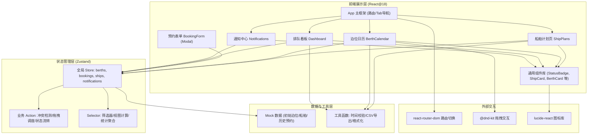
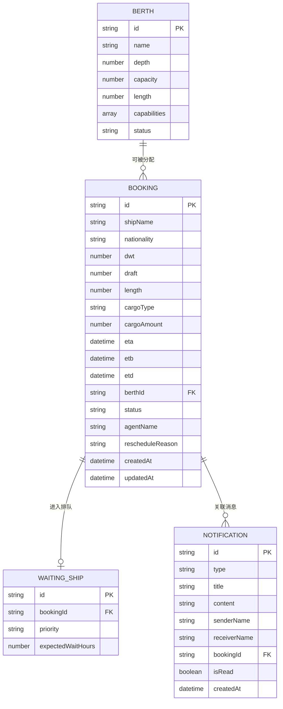

## 1. 架构设计



## 2. 技术描述
- **前端框架**：React@18 + TypeScript@5，Vite@5 构建
- **样式方案**：TailwindCSS@3 + CSS 变量（主题色/暗色系统）
- **状态管理**：Zustand@4（轻量无模板，适合小型业务系统）
- **路由**：react-router-dom@6（SPA 多 Tab 页面切换）
- **拖拽库**：@dnd-kit（日历拖拽调度，性能优于 react-dnd）
- **图标**：lucide-react（统一线性图标，支持动画）
- **日期处理**：date-fns（替代 moment，轻量 immutable）
- **后端**：无，使用本地 Mock 数据 + localStorage 持久化
- **数据存储**：localStorage（用户操作保存） + 内置 Mock 初始化

## 3. 路由定义
| Route | 页面组件 | 功能说明 |
|-------|---------|---------|
| `/` | Dashboard（排队看板） | 首页默认展示看板，掌握全局调度状态 |
| `/plans` | ShipPlans（船舶计划页） | 靠泊计划列表，状态管理，导出功能 |
| `/calendar` | BerthCalendar（泊位日历） | 可视化日历，拖拽调度核心页面 |
| `/notifications` | Notifications（通知中心） | 消息收发，船代协同沟通 |

## 4. 核心数据类型定义

```typescript
// 泊位
interface Berth {
  id: string;
  name: string;           // 泊位名称 如 "3号泊位"
  depth: number;          // 水深 (米)
  capacity: number;       // 最大靠泊吨位 (DWT, 吨)
  length: number;         // 泊位长度 (米)
  capabilities: CargoType[]; // 作业能力
  status: 'available' | 'occupied' | 'maintenance';
}

// 货物类型
type CargoType = 'container' | 'bulk' | 'liquid' | 'gas' | 'general';

// 预约状态
type BookingStatus = 'pending' | 'confirmed' | 'berthed' | 'departed' | 'cancelled';

// 船舶预约
interface Booking {
  id: string;
  shipName: string;           // 船名
  imoNumber?: string;         // IMO编号
  nationality: string;        // 国籍
  dwt: number;                // 载重吨
  draft: number;              // 吃水 (米)
  length: number;             // 船长 (米)
  cargoType: CargoType;
  cargoAmount: number;        // 货量 (吨/TEU)
  specialRequirements?: string; // 特殊作业需求
  eta: Date;                  // 预计到港
  etb: Date;                  // 预计靠泊
  etd: Date;                  // 预计离港
  berthId: string | null;     // 分配泊位
  status: BookingStatus;
  agentId: string;            // 船代ID
  agentName: string;          // 船代名称
  rescheduleReason?: string;  // 改期原因
  createdAt: Date;
  updatedAt: Date;
}

// 等待队列船舶
interface WaitingShip {
  id: string;
  bookingId: string;
  priority: 'high' | 'normal' | 'low';
  expectedWaitHours: number; // 预计等待小时
}

// 通知消息
interface Notification {
  id: string;
  type: 'confirm' | 'reschedule' | 'alert' | 'system' | 'custom';
  title: string;
  content: string;
  senderId: string;
  senderName: string;
  receiverId: string;
  receiverName: string;
  bookingId?: string;
  relatedShipName?: string;
  isRead: boolean;
  createdAt: Date;
}

// 冲突信息
interface ConflictInfo {
  hasConflict: boolean;
  conflictWithBookingId?: string;
  conflictShipName?: string;
  overlapStart?: Date;
  overlapEnd?: Date;
}
```

## 5. 数据模型 ER 图



## 6. 目录结构设计

```
src/
├── main.tsx              # 入口
├── App.tsx               # 路由 + 导航框架
├── index.css             # Tailwind + 主题变量 + 全局样式
├── store/
│   └── usePortStore.ts   # Zustand 全局状态 + Action
├── data/
│   ├── mockBerths.ts     # 初始泊位 Mock 数据 (8个泊位)
│   ├── mockBookings.ts   # 初始预约 Mock (15条示例数据)
│   └── mockNotifications.ts # 初始消息 Mock
├── types/
│   └── index.ts          # 全局 TypeScript 类型定义
├── utils/
│   ├── timeUtils.ts      # 时间格式化/冲突检测/校验
│   └── exportUtils.ts    # CSV 导出工具
├── hooks/
│   └── useConflictDetect.ts # 冲突检测自定义 Hook
├── components/
│   ├── layout/
│   │   ├── Header.tsx        # 顶部导航 (Logo/菜单/通知铃铛/用户)
│   │   ├── Sidebar.tsx       # 左侧 Tab 导航栏
│   │   └── PageContainer.tsx # 通用页面容器
│   ├── common/
│   │   ├── StatusBadge.tsx   # 状态标签 (pending/confirmed 等)
│   │   ├── CargoIcon.tsx     # 货类图标
│   │   ├── ShipMiniCard.tsx  # 船舶迷你卡片
│   │   └── EmptyState.tsx    # 空状态组件
│   ├── dashboard/
│   │   ├── StatsCards.tsx    # 4个统计大卡片
│   │   ├── WaitingQueue.tsx  # 等待队列列
│   │   ├── BerthStatusList.tsx # 泊位状态列
│   │   └── TimeoutAlerts.tsx # 超时提醒列
│   ├── plans/
│   │   ├── PlanToolbar.tsx   # 搜索/筛选/导出工具栏
│   │   ├── PlanTable.tsx     # 计划表格
│   │   └── RescheduleModal.tsx # 改期原因弹窗
│   ├── calendar/
│   │   ├── ViewToggle.tsx    # 周/日视图切换
│   │   ├── FilterPanel.tsx   # 水深/能力筛选器
│   │   ├── CalendarGrid.tsx  # 日历网格主体
│   │   └── BookingCard.tsx   # 日历卡片 (可拖拽)
│   ├── booking/
│   │   ├── BookingForm.tsx   # 预约主表单 (双栏)
│   │   ├── ShipInfoSection.tsx # 船舶信息组
│   │   ├── CargoSection.tsx  # 货物信息组
│   │   └── BerthRecommend.tsx # 泊位推荐列表
│   └── notifications/
│       ├── CategoryNav.tsx   # 分类导航
│       ├── MessageList.tsx   # 消息列表
│       ├── MessageDetail.tsx # 消息详情面板
│       └── SendMessageModal.tsx # 发送消息弹窗
└── pages/
    ├── DashboardPage.tsx
    ├── PlansPage.tsx
    ├── CalendarPage.tsx
    └── NotificationsPage.tsx
```

## 7. 核心业务算法说明

### 7.1 时间冲突检测算法
```typescript
function detectConflict(
  newBooking: { etb: Date; etd: Date; berthId: string; excludeId?: string },
  allBookings: Booking[]
): ConflictInfo {
  // 同一泊位且时间区间有交集 (A.etb < B.etd && A.etd > B.etb)
  const sameBerth = allBookings.filter(
    b => b.berthId === newBooking.berthId 
      && b.id !== newBooking.excludeId
      && b.status !== 'departed' 
      && b.status !== 'cancelled'
  );
  for (const existing of sameBerth) {
    const overlapStart = max(newBooking.etb, existing.etb);
    const overlapEnd = min(newBooking.etd, existing.etd);
    if (overlapStart < overlapEnd) {
      return { hasConflict: true, conflictWithBookingId: existing.id, overlapStart, overlapEnd };
    }
  }
  return { hasConflict: false };
}
```

### 7.2 泊位推荐算法
```typescript
function recommendBerths(bookingDraft: BookingDraft, berths: Berth[]): Berth[] {
  return berths
    .filter(b => 
      b.status !== 'maintenance'
      && b.depth >= bookingDraft.draft + 0.5  // 富余水深 0.5m
      && b.capacity >= bookingDraft.dwt
      && b.length >= bookingDraft.length + 20 // 富余长度 20m
      && b.capabilities.includes(bookingDraft.cargoType)
    )
    .sort((a, b) => {
      // 优先推荐占用率低（空闲时间多）的泊位
      return getUtilizationRate(a) - getUtilizationRate(b);
    });
}
```
